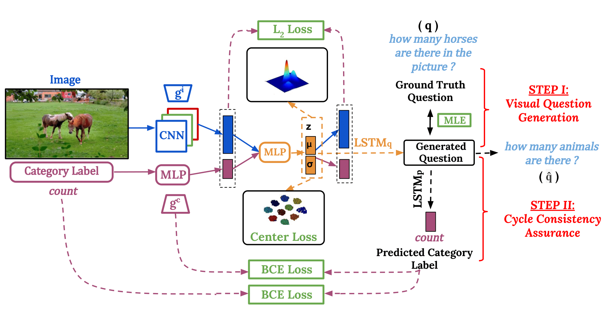

# C3VQG: Category Consistent Cyclic Visual Question Generation

This repository contains code for the paper <a href="https://arxiv.org/abs/2005.07771"> C3VQG: Category Consistent Cyclic Visual Question Generation</a> accepted at ACM Multimedia Asia 2020, Singapore.



In case you find any of this useful, consider citing:

```
@article{Uppal2020C3VQGCC,
  title={C3VQG: Category Consistent Cyclic Visual Question Generation},
  author={Shagun Uppal and Anish Madan and Sarthak Bhagat and Yi Yu and Rajiv Ratn Shah},
  journal={ArXiv},
  year={2020},
  volume={abs/2005.07771}
}
```

The structure of the code is adopted from https://github.com/ranjaykrishna/iq.

## Installing Dependencies

In order to clone our repository and install all the required dependencies, follow these set of commands:

```
git clone https://github.com/sarthak268/c3vqg-official.git
cd c3vqg-official
virtualenv -p python2.7 env
source env/bin/activate
pip install -r requirements.txt
git submodule init
git submodule update
mkdir -p data/processed
```

## Preparing Data

Download the train and validation sets of the <a href="https://visualqa.org/download.html">VQA Dataset</a>.

In order to prepare the data for training and evaluation, follow these set of commands:

```
# Create the vocabulary file.
python utils/vocab.py

# Create the hdf5 dataset.
python utils/store_dataset.py
python utils/store_dataset.py --output data/processed/iq_val_dataset.hdf5 --questions data/vqa/v2_OpenEnded_mscoco_val2014_questions.json --annotations data/vqa/v2_mscoco_val2014_annotations.json --image-dir data/vqa/val2014
```

## Training and Evaluation

In order to begin training, run the following command:

```
python train.py
```

In order to evaluate the trained model using various language modeling metrics, run the following command:

```
python evaluate.py
```

## Contact

If you face any problem in running this code, you can contact us at {shagun16088, anish16223 sarthak16189}@iiitd.ac.in.

## License

Copyright (c) 2020 Shagun Uppal, Anish Madan, Sarthak Bhagat, Yi Yu, Rajiv Ratn Shah.

For license information, see LICENSE or http://mit-license.org
